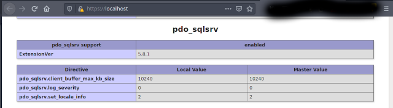

# PHP to MSSQL connect
php file to connect with mssql server, plus localhost using ssh


running 
````
$ docker-compose build
$ docker-compose up -d
````

you can add another git project web in `web` folder
````
git submodule add https://github.com/your/webphpmssql.git web
````

and if you want to update your submodule
````
git submodule update --remote
````

if we want to clone full with submodule
````
git clone https://github.com/g3n1k/docker-php2mssql.git your_project
cd your_project
git submodule init
````
now we pull submodule
````
git submodule update
````

or if we want the latest from submodule
````
git submodule update --remote
````
  
https://g3n1k.wordpress.com/2020/10/05/git-implement-submodule-logs/